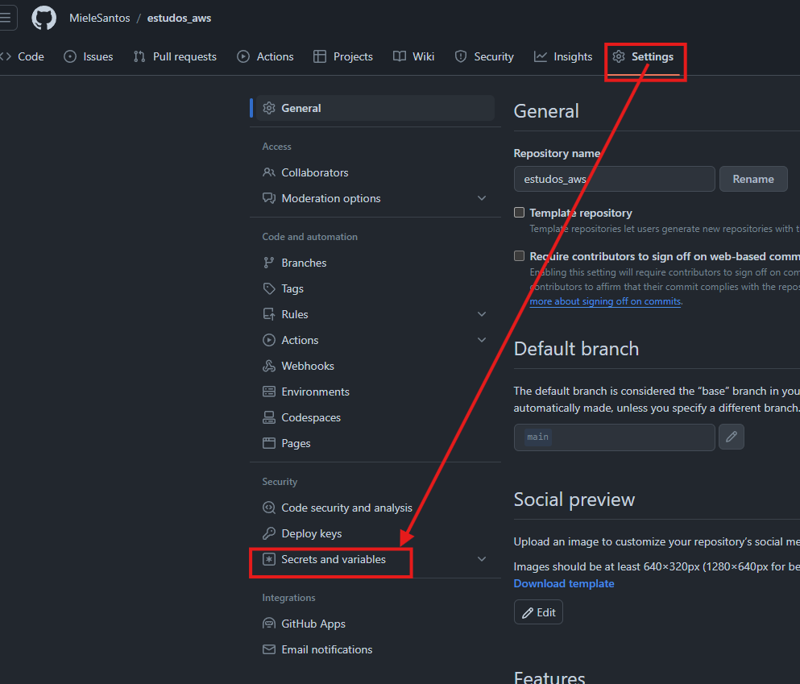
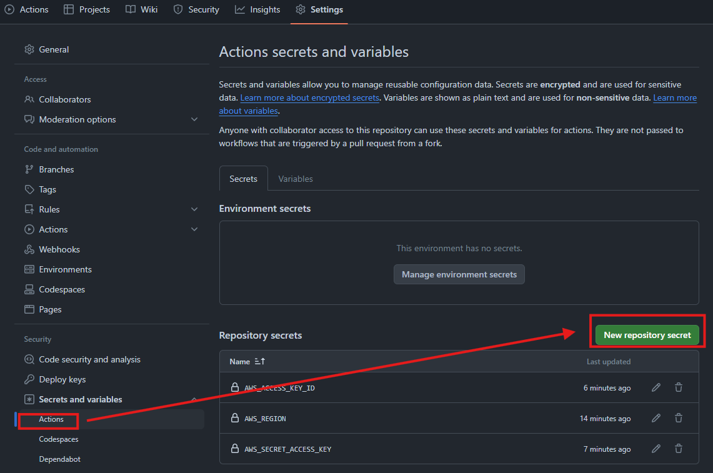

# AWS Lambda


### 1. O que é AWS Lambda?

AWS Lambda é um serviço de computação sem servidor que permite executar código em resposta a eventos sem precisar provisionar ou gerenciar servidores. Você paga apenas pelo tempo de computação que consome – não há cobrança quando seu código não está em execução.

### 2. Principais Benefícios

Sem servidor: Não é necessário gerenciar a infraestrutura subjacente.
Escalabilidade automática: Lambda escala automaticamente de acordo com o volume de solicitações.
Cobrança baseada em uso: Pague apenas pelo tempo de execução do seu código.

### 3. Como Funciona?

Eventos de disparo: AWS Lambda é ativado por eventos, como alterações em um bucket do S3, atualizações em um banco de dados DynamoDB, ou solicitações HTTP via API Gateway.
Funções Lambda: O código que você quer executar em resposta aos eventos é encapsulado em funções Lambda. Cada função pode ser escrita em várias linguagens, incluindo Node.js, Python, Java, C#, e Go.

### 4. Componentes Chave

Função Lambda: O bloco de construção central que contém seu código.
Camadas (Layers): Pacotes que podem ser utilizados em várias funções Lambda, úteis para compartilhar bibliotecas.
Trigger/Eventos: Fontes de eventos que disparam a execução de funções Lambda.
Logs e Monitoramento: Ferramentas como Amazon CloudWatch são usadas para monitorar a execução das funções Lambda.
### 5. Criando uma Função Lambda

Definir uma função: Escreva o código e defina suas configurações (memória, tempo de execução, etc.).
Configurar triggers: Escolha quais eventos vão disparar a função.
Testar e depurar: Utilize o console do AWS ou ferramentas locais para testar e depurar o código.
Deploy: Faça o deploy da função e monitore através de logs.
### 6. Casos de Uso Comuns
Processamento de Dados em Tempo Real: Processamento de streams de dados de serviços como Amazon Kinesis ou DynamoDB Streams.
Automação de Tarefas de Backend: Tarefas como backups automáticos, limpeza de dados, e notificações.
APIs sem Servidor: Construção de backends para aplicativos web e móveis utilizando API Gateway e AWS Lambda.
### 7. Boas Práticas

Código pequeno e eficiente: Mantenha suas funções pequenas para garantir desempenho e facilidade de manutenção.
Gerenciamento de dependências: Utilize Layers para gerenciar dependências e reutilizar código.
Monitoramento e logs: Implemente monitoramento adequado para rastrear a performance e possíveis erros.
Segurança: Gerencie permissões com IAM roles adequados para minimizar riscos de segurança.
### 8. Limitações e Considerações

Tempo máximo de execução: Uma função Lambda pode rodar por no máximo 15 minutos.
Memória e CPU limitados: Há limites para recursos que podem ser alocados a uma função.
Cold starts: A primeira execução de uma função pode ser mais lenta devido ao tempo de inicialização.
### 9. Integração com Outros Serviços AWS

Amazon S3: Processamento de objetos armazenados.
Amazon DynamoDB: Reações a mudanças em tabelas.
Amazon API Gateway: Criação de APIs RESTful e WebSocket.
Amazon CloudWatch: Monitoramento e logging das funções Lambda.

### 10. Ferramentas e SDKs
AWS Management Console: Interface gráfica para gerenciar funções Lambda.
AWS CLI: Interface de linha de comando para automação e scripts.
SDKs: Suporte para várias linguagens de programação (Boto3 para Python, AWS SDK for JavaScript, etc.).

### Aws CLI 

Usando Aws cli para subir a função lambda zipada para aws lambda
Exemplo de comando
```bash
aws lambda update-function-code --function-name firstFunction --zip-file fileb://lambda.zip
```


### Usando Action para da deploy da lambda na Aws

Antes de adiciona a `action`, precisa configura as `secrets` da aws, para isso, dentro do repositorio no github,
clique e settings e em `Secrets and variables`, depois em `action` e em `New repository secret`, adicionando 3 secrets:

- AWS_ACCESS_KEY_ID
- AWS_REGION
- AWS_SECRET_ACCESS_KEY

Como mostra as images<br>

<br>
Como mostra a image



Depois de configura as secrets da aws, crie a action, pode ser usado o modelo padrão que se encontra no marketplace do github,
fazendo as alterações necessarias para sua action, seguindo o exemplo abaixo

```
name: deploy to lambda
on: [push]
jobs:

  deploy_zip:
    name: deploy lambda function
    runs-on: ubuntu-latest
    steps:
      - name: checkout source code
        uses: actions/checkout@v3
      - name: Generate zip
        run: |
          zip lambda.zip *.py  
      - name: default deploy
        uses: appleboy/lambda-action@v0.2.0
        with:
          aws_access_key_id: ${{ secrets.AWS_ACCESS_KEY_ID }}
          aws_secret_access_key: ${{ secrets.AWS_SECRET_ACCESS_KEY }}
          aws_region: ${{ secrets.AWS_REGION }}
          function_name: firstFunction
          zip_file: lambda.zip
```